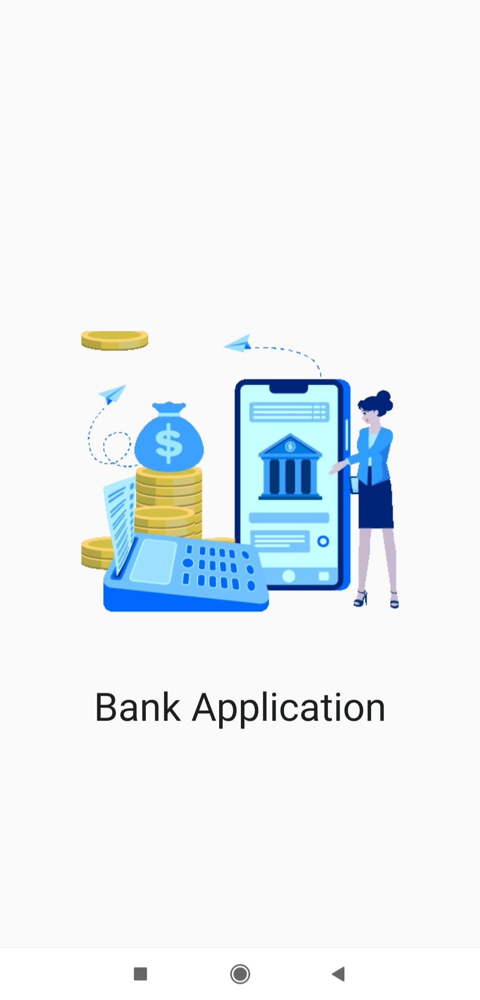
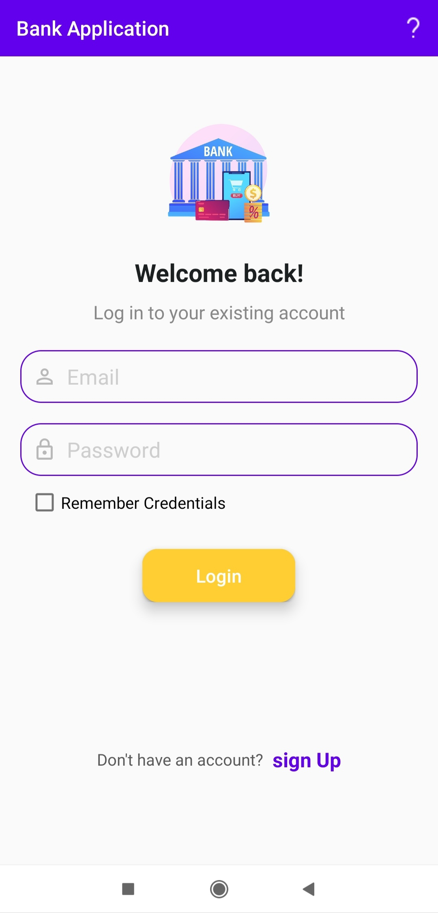
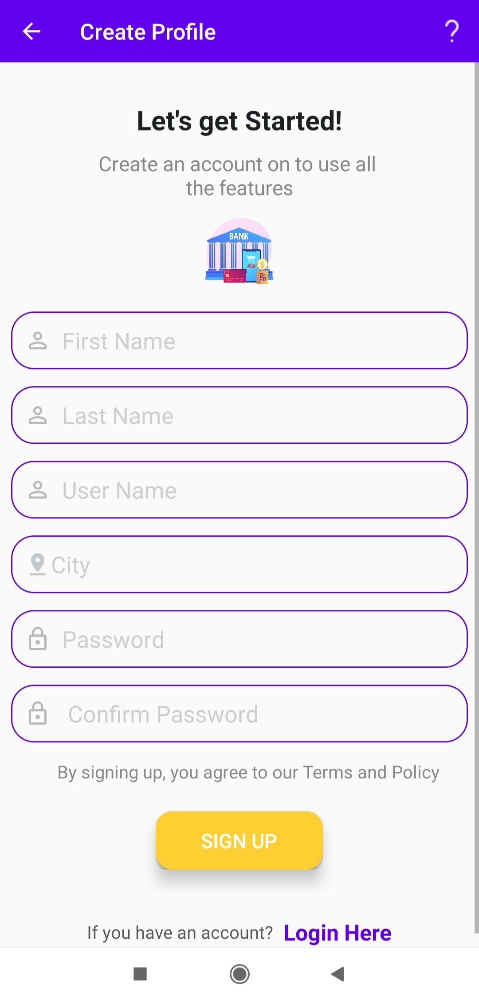
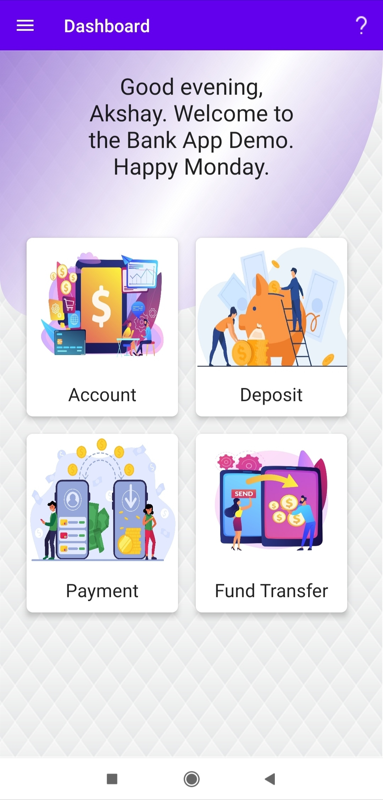
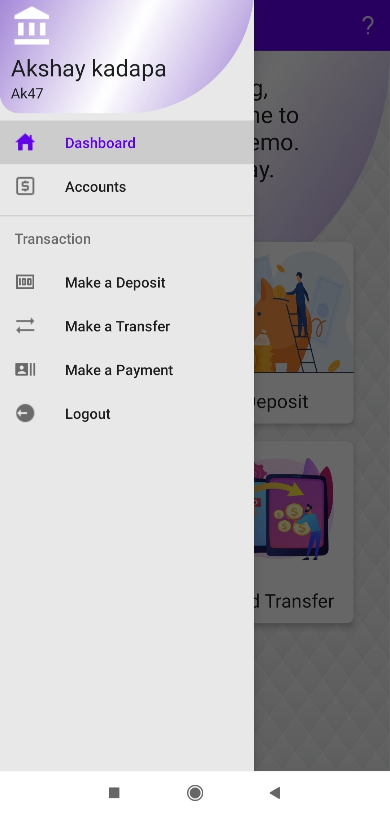
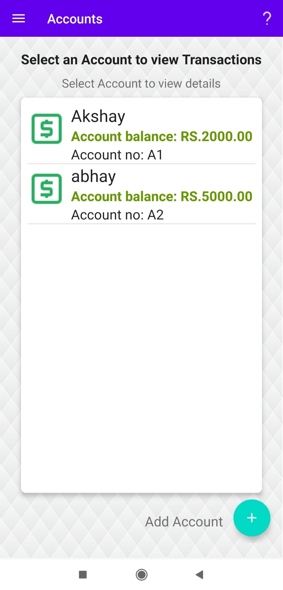
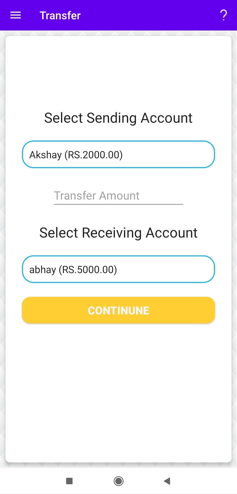
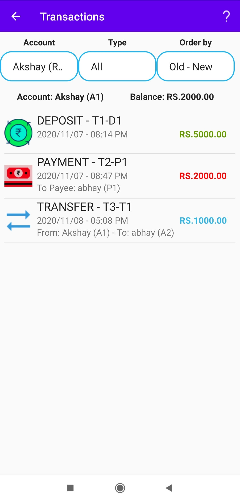
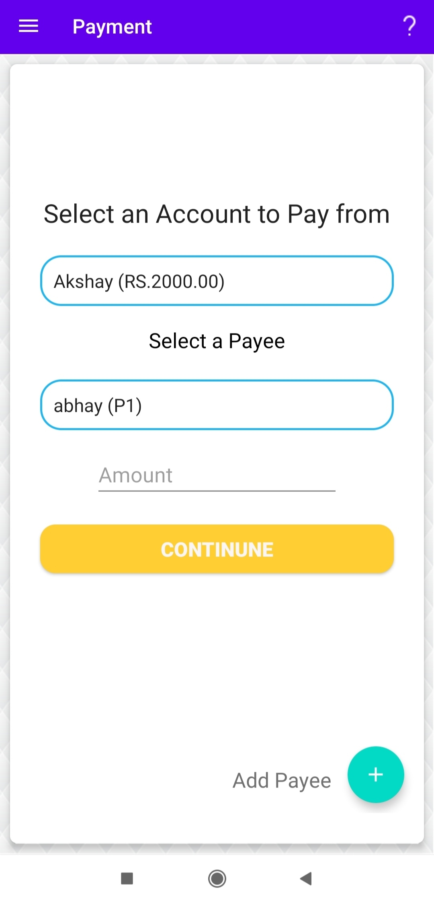

# BankAppliction

# PROJECT DETAILS

A Banking app made for Android using Android Studio.

The app starts out with a login screen, in which the user can either log in with an existing profile, or click a button and create a new profile. When signed in, the user will be brought to their dashboard page, which (when first creating a profile), will prompt them to make their first account. Additionally, there is a menu that slides from the left which includes all of the options for the app, including Dashboard, Account Overview (and subsequently Transactions), Deposits, Payments, Transfers, Profile Settings and Logout. 

# ANDROID DEVELOPMENT CONCEPTS USED

- Runs on Android API 21 and up
- Multiple Activitiy
- Multiple Fragments
- Modern UI Layouts: SplashScreen,CardLayout.
- Custom Toolbar
- DrawerLayout
- Array Adapters
- SQLite Database: All Profile, Account, Payee and Transaction information is stored in a database.
- Shared Preferences: Saving the current profile (logged into by the user), and all of its general info, accounts and transactions.

# SCREENSHOTS

   

  
 
   

